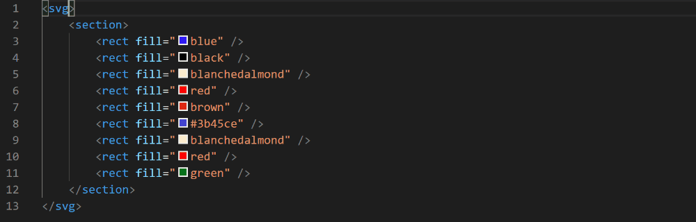

# Fitbit SDK Extension for vscode

[](https://marketplace.visualstudio.com/items?itemName=JeremyJeanson.fitbit-sdk-extension)

This extension was built to help developers to use the Fitbit SDK when they use Visual Studio Code.

It coudl be installed form [the marketplace](https://marketplace.visualstudio.com/items?itemName=JeremyJeanson.fitbit-sdk-extension).


# Current status

This extension is under active development. Features will be added over time. 

- [x] CSS custom data.
- [ ] CSS Linter (to avoid problems with `$`).
- [x] SVG files associations.
- [x] SVG coloration.
- [x] SVG snippets.
    - [x] Basic controls.
    - [x] Buttons.
    - [x] Texts.
    - [x] Views.
    - [x] Other.
    - [x] Animations.
- [ ] SVG Language.
    - [x] Completion (All SVG elements and attributs used by the Fitbit SDK, to avoid errors).
    - [x] Documentation when mouse is hover elements.
    - [x] Format.
    - [x] Colors (display and edit).
    - [ ] Validation.

# Exemples

Code completion.


View and edit colors.


Snippets to define symbols and animations.


Snippets to use Fitbit SDK components.


Snippets to include link to the Fitbit SDK definitions.


Display documentation when mouse is hover elements.


# vscode-icons users
If you are using the vscode-icons extension, you could change your settings to bind the SVG icon to the Fitbit DSK files.

It could be done by adding this code to your Visual Studio Code settings :

```json
"vsicons.associations.files": [
    {
        "icon": "svg",
        "extensions": [
            "gui",
            "defs",
            "view"
        ],
        "format": "svg"
    }
]
```

# Contribute or report issues
You can report any issue via GitHu. If you found one, please report it! This code was open to be shared and improved. If you have an idea, tell it or send a pull request. 